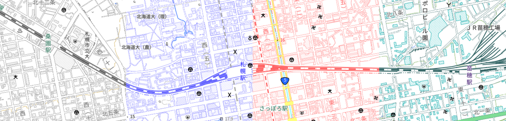
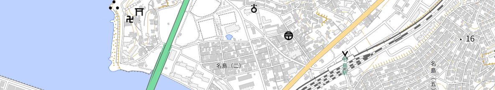
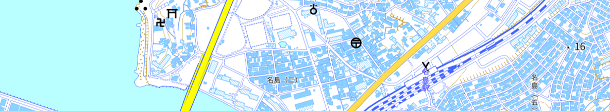

# gsi-style-color-analysis
機械的に色を置き換えるツールで、いろいろな[地理院地図Vector](https://maps.gsi.go.jp/vector/)用スタイルを作ってみるレポジトリ。

[作成したスタイルサンプル集](https://mghs15.github.io/gsi-vector-style-samples/)

## 概要
地理院地図Vectorのスタイルファイルを、色だけ変更することで、「いい感じ」のスタイルを量産することを目的とする。
特定の色（rgb値で指定されている）を変換表に基づいて別の色へ変更することになるが、この「変換表」をなるべく労力をかけずに作ることができればよい。

## ツールの説明

※地理院地図Vectorのスタイル保存機能で出力されるJSONファイルの改行を前提としたツールです。

### `perl-style-color-analysis.pl`

同階層に置かれたスタイルJSONファイルに含まれる色情報を分析するとともに、スクリプト内に記述されたrgbの変換条件に従い、次の工程に必要なコードを生成する。
以下のファイルが「results」フォルダに出力される。
* `results2_(生成日時).txt` : スタイルに含まれる色と、その色の出現回数を記録したもの。
* `perlcode_(生成日時).txt` : 変換用スクリプト（＝変換リスト）。
* `colorlist_(生成日時).html` : 変換前後の色を視覚的に確認するためのHTMLページ。

また、同階層に`tmp_perlcode.txt`が出力される。これは、文字列置換式として記述された変換表で、`s2-style-color-replace.pl`で利用される。

### `s2-style-color-replace.pl`

`tmp_perlcode.txt`を読み込んでPerlコードとして実行し、ベースとなるスタイル（同階層に置かれたスタイルJSONファイル）の色を変換する。結果は、「results」フォルダに`routput_(生成日時)(元のスタイルJSONファイル名)`という名前で出力される。

### `s1-style-color-replace.pl`

上記で生成された、`perlcode_生成日時.txt`を手動でコピペして書き込むことで、ベースとなるスタイル（同階層に置かれたスタイルJSONファイル）の色を変換する。結果は、「results」フォルダに`routput_(生成日時)(元のスタイルJSONファイル名)`という名前で出力される。

## スタイル変換の手順
### ベースとなるスタイルの準備
色の変換元になるベーススタイルを準備する。基本的に、標準地図か、淡色地図ということになると思う。
細かく色が分かれているほど、変換時に小回りが利くが、その分設定する色が多くなる。
今回は試験的ということもあり、淡色地図をベースとすることにした。

淡色地図を細かく分析すると、同じ色でも、`rgba(255,255,255,1)`と`rgb(255,255,255)`が混在していたため、全てrgbaで統一した。
また、たとえば、`rgba(255,254,255,1)`というような、gだけ1異なるという設定もあったため、そのような色については、他の要素にそろえることとした。

このようにして、整理した結果、アルファ値の違いも含めて、全部で37色からなるベーススタイルが準備できた。

整理後の淡色地図に含まれる色一覧

 
<table>
<tr><td>0</td><td>rgba(0,0,0,0)</td></td><td>海岸線←岩等に接する部分</td></tr>
<tr><td>0</td><td>rgba(0,0,0,1)</td></td><td>注記</td></tr>
<tr><td>0</td><td>rgba(100,100,100,0)</td></td><td>桟橋枠線</td></tr>
<tr><td>0</td><td>rgba(100,100,100,0.75)</td></td><td>小縮尺鉄道</td></tr>
<tr><td>0</td><td>rgba(100,100,100,1)</td></td><td>橋枠線、鉄道、注記</td></tr>
<tr><td>0</td><td>rgba(113,113,113,1)</td></td><td>注記</td></tr>
<tr><td>0</td><td>rgba(128,128,128,1)</td></td><td>高塔</td></tr>
<tr><td>0</td><td>rgba(140,140,140,1)</td></td><td>注記（小縮尺）</td></tr>
<tr><td>0</td><td>rgba(150,150,150,1)</td></td><td>駅部分</td></tr>
<tr><td>0</td><td>rgba(160,160,160,1)</td></td><td>道路枠線</td></tr>
<tr><td>0</td><td>rgba(170,170,170,1)</td></td><td>行政界</td></tr>
<tr><td>0</td><td>rgba(173,173,173,0.75)</td></td><td>市町村道</td></tr>
<tr><td>0</td><td>rgba(173,173,173,1)</td></td><td>市町村道</td></tr>
<tr><td>0</td><td>rgba(200,200,200,1)</td></td><td>索道、地下鉄駅、建物外周線など</td></tr>
<tr><td>0</td><td>rgba(210,210,210,1)</td></td><td>堅ろう建物ハッチ、普通建物塗りつぶし</td></tr>
<tr><td>0</td><td>rgba(220,220,220,0.75)</td></td><td>都道府県道</td></tr>
<tr><td>0</td><td>rgba(220,220,220,1)</td></td><td>都道府県道</td></tr>
<tr><td>0</td><td>rgba(230,230,230,1)</td></td><td>湿地</td></tr>
<tr><td>0</td><td>rgba(255,255,255,0)</td></td><td>白</td></tr>
<tr><td>0</td><td>rgba(255,255,255,1)</td></td><td>白</td></tr>
<tr><td>0</td><td>rgba(80,80,80,1)</td></td><td>注記←集落名称（通称）</td></tr>
<tr><td>0</td><td>rgba(88,88,88,0.75)</td></td><td>小縮尺新幹線</td></tr>
<tr><td>0</td><td>rgba(88,88,88,1)</td></td><td>小縮尺新幹線</td></tr>
<tr><td>1</td><td>rgba(100,0,0,1)</td></td><td>鉄道軌道</td></tr>
<tr><td>1</td><td>rgba(200,160,60,1)</td></td><td>地下・トンネル、等高線</td></tr>
<tr><td>1</td><td>rgba(238,202,119,1)</td></td><td>小縮尺道路</td></tr>
<tr><td>1</td><td>rgba(255,220,150,0.75)</td></td><td>国道</td></tr>
<tr><td>1</td><td>rgba(255,220,150,1)</td></td><td>国道</td></tr>
<tr><td>1</td><td>rgba(37,30,28,1)</td></td><td>国の所属界</td></tr>
<tr><td>2</td><td>rgba(120,220,160,0.75)</td></td><td>高速道路</td></tr>
<tr><td>2</td><td>rgba(120,220,160,1)</td></td><td>高速道路</td></tr>
<tr><td>2</td><td>rgba(123,183,124,1)</td></td><td>小縮尺高速道路等</td></tr>
<tr><td>2</td><td>rgba(19,97,69,1)</td></td><td>駅名、道路名等注記</td></tr>
<tr><td>3</td><td>rgba(101,159,216,1)</td></td><td>水涯線</td></tr>
<tr><td>3</td><td>rgba(190,210,255,1)</td></td><td>水域</td></tr>
<tr><td>3</td><td>rgba(20,90,255,1)</td></td><td>海岸線</td></tr>
<tr><td>3</td><td>rgba(43,107,255,1)</td></td><td>枯れ川水涯線・湖底急斜面</td></tr>
</table>
 

### 変換表作成
本当ならば、37色に対して、それぞれ色を振るべきであるが、それは面倒くさいので、機械的にrgb値をいじることで、いい感じのスタイルができないかと試みた。

まず、rgb値をすべて、`(r+b+g)/3`とした値に変更することで、モノクロの地図がある程度いい感じにできるが、もっとカラフルになると、単一の変換式ではうまくいかなかった。（そもそも、単一の変換式を適用するだけなら、ラスタデータでも済むので、ベクトルデータを活用する点では、もう少し工夫を行いたい。）

そのため、「もともとの色をいくつかのパターンに分け、パターンごとに、rgbを操作する」という工夫を行った。
パターン分けは、以下の９通り。
* r=g=b
  * 注記の場合
  * 注記以外の場合
    * 白（r=g=b=255）
    * 白以外
* rが最も大きい場合（r=gも含む）
  * 等高線・トンネル等の場合
  * 等高線・トンネル等以外の場合
* gが最も大きい場合（g=bも含む）
  * 注記の場合
  * 注記以外の場合
* bが最も大きい場合
  * 水域の場合
  * 水域以外の場合

最初は、単純に、rgbの大きさによる4パターンで試していたが、以下の理由から、さらに条件分岐を行っている。
* 注記は文字の視認性のためにほかの地物と独立して制御したいことが多いこと。
* 等高線や水域は地図内の広範囲を占めるため、地図の印象に大きく影響を与えるため。
* 多くの場合、白`rgba(255,255,255,1)`については、そのまま処理をした方がきれいな場合が多い（三項演算子で処理）。

また、テーマカラーを設定するにあたり、「r=g=b -> 注記以外の場合 -> 白以外の場合」について、たとえば、r>169の薄い灰色の場合だけテーマカラーを（淡い色合いで）設定してあげると、地図全体に占めるテーマカラーの割合を増やしつつも、うるさくならずにきれいな見栄えになるような気がする。

パターンごとの設定の例

元のデータをR、G、B、変換後の色をR'、G'、B'とする。 

<table>
<tr>
 <td rowspan="2">R=G=B</td>
 <td>注記</td><td>R'=R G'=G B'=B</td>
</tr><tr>
 <td>注記以外</td><td>R'=R/1.5 (R <= 254) R'=R (R > 254) G=G' B=255</td>
</tr><tr>
 <td rowspan="2">Rが最も大きい場合 （r=gも含む）</td>
 <td>地下・トンネル、等高線 rgba(200,160,60,1)</td><td>R'=R G'=G B'=B</td>
</tr><tr>
 <td>地下・トンネル、等高線以外</td><td>R'=R G'=G B'=B</td>
</tr><tr>
 <td rowspan="2">Gが最も大きい場合 （g=bも含む）</td>
 <td>注記</td><td>R'=0 G'=0 B'=255</td>
</tr><tr>
 <td>注記以外</td><td>R'=255 G'=255 B'=0</td>
</tr><tr>
 <td rowspan="2">Bが最も大きい場合</td>
 <td>水域 rgba(190,210,255,1)</td><td>R'=185 G'=255 B'=255</td>
</tr><tr>
 <td>水域以外</td><td>R'=R G'=G B'=B</td>
</tr>
</table>

### 試行錯誤
あとは、`colorlist_(生成日時).html`を見ながら、「いい感じ」と思えるような変換表になるまでrgbの変換部分の調整を行う。時には、最終的に`s1-style-color-replace.pl`で生成されたスタイルを手動で調整することも必要。

## Mapbox Style Specに準拠したスタイルに変換したい場合
地理院地図Vectorのスタイルは、そのままでは、素のMapbox GL JSでは利用できません。[gsi-vector-style-converter](https://github.com/mghs15/gsi-vector-style-converter)レポジトリで、地理院地図VectorのスタイルをMapbox GL JSでも使えるMapbox Style Spec準拠のスタイルに変換するツールを用意しております。

素のMapbox GL JSで、ハッチング表現（建物、湿地など）の実現には、別途ハッチング用のデータを生成の上、読み込む必要があります。（ハッチング用データ生成については、[gsi-vector-style-converter](https://github.com/mghs15/gsi-vector-style-converter)で行えます。）

ただ、面倒くさいという方は、[gsi-vector-mapbox-gl-js-without-hatch](https://github.com/mghs15/gsi-vector-mapbox-gl-js-without-hatch)レポジトリでの検討を参考に、ベースとなるスタイルJSONファイルのハッチ表現を塗りつぶし表現に変換したうえで、`perl-style-color-analysis.pl`、`s2-style-color-replace.pl`の処理にかけることもできます。

## 成果
* 今まで作成した変換式・変換表を含む`perl-style-color-analysis.pl`、`s1-style-color-replace.pl`は「archive」フォルダに置いてあります。
* 今まで作成したスタイルファイルは「style」フォルダに置いてあります。

## 参考文献
地理院地図Vector https://github.com/gsi-cyberjapan/gsimaps-vector-experiment
